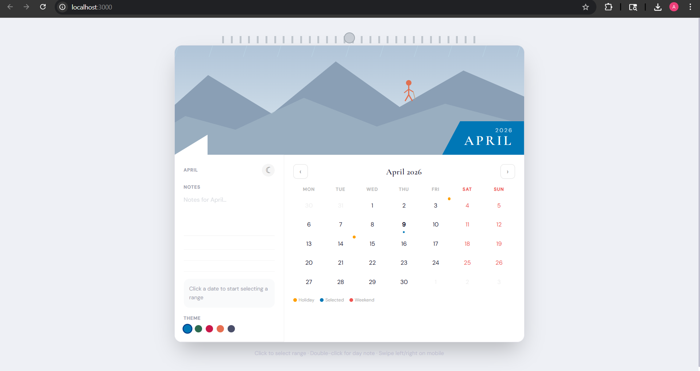
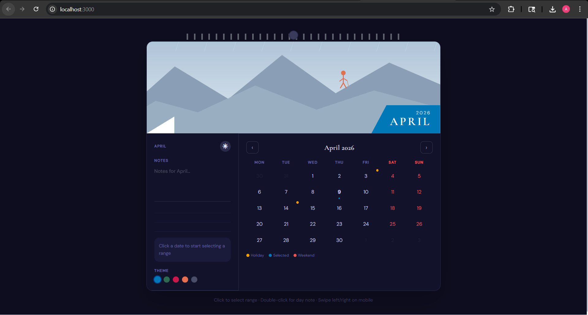
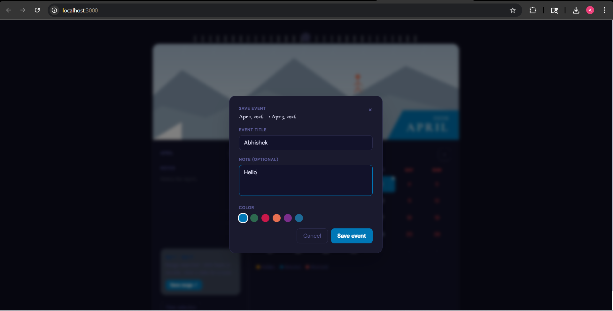
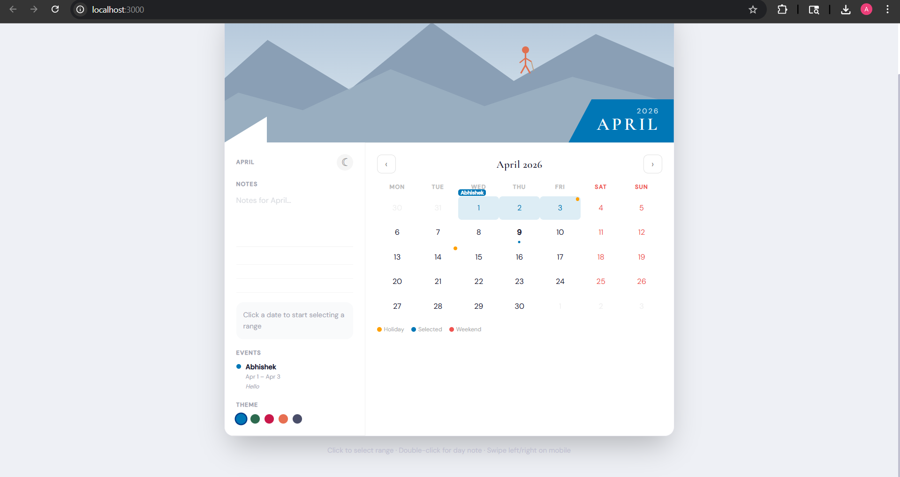

# 📅 Wall Calendar — Interactive Next.js Component

> A polished, production-grade interactive wall calendar built as part of a Frontend Engineering Challenge. Translates a physical wall calendar aesthetic into a fully functional, responsive, and accessible web component.


---

## 📸 Preview



## 🌑 Themes (Dark / Light )


## 📅 Date, Notes and Event 


## 🛬 Final with events 



---

## ✅ Core Requirements Met

| Requirement | How it's implemented |
|---|---|
| **Wall Calendar Aesthetic** | Wire binding at top, full-width SVG hero illustration per month, diagonal chevron + month badge — mirrors the physical reference image |
| **Day Range Selector** | Single click sets start date, second click sets end date. Live hover preview highlights the range before confirming. Distinct visual states for start (pill left), end (pill right), in-between (light fill) |
| **Integrated Notes Section** | Three layers: month-level freeform notes, per-date notes (double-click any day), and notes attached to a saved named event/range |
| **Fully Responsive** | Desktop: side-by-side notes panel + calendar grid. Mobile: stacked vertically, touch swipe left/right to change months |

---

## 🚀 Extra Features (Going Beyond the Baseline)

| Feature | Detail |
|---|---|
| **Month slide animation** | Hero illustration slides in from the correct direction (left or right) on every month change using CSS keyframes + React key trick |
| **Holiday markers** | Indian public holidays for 2025–2026 shown with amber dot indicators and hover tooltips on the calendar grid |
| **Named events with color** | After selecting a range, save it as a named event with a custom label, note, and color. Events appear as colored labels on the calendar |
| **Dark mode** | Full dark/light toggle with smooth transition, persisted to localStorage |
| **5 color themes** | Ocean, Forest, Rose, Amber, Slate — switches the entire accent color system including hero gradient, range highlights, and badges |
| **12 SVG hero illustrations** | One unique hand-crafted SVG scene per calendar month (snowy peaks, cherry blossoms, beach sunset, autumn foliage, etc.) |
| **Touch swipe navigation** | Swipe left/right on mobile to navigate months — native-feeling on touch devices |
| **Print styles** | Ctrl/Cmd + P renders a clean, ink-friendly calendar printout |
| **Keyboard accessibility** | Full keyboard navigation, ARIA labels on all interactive elements, visible focus rings |
| **localStorage persistence** | All notes, saved events, theme choice, and dark mode preference survive page refresh |

---

## 🛠 Tech Stack

| Layer | Choice | Why |
|---|---|---|
| Framework | Next.js 14 (App Router) | Clean RSC/client split, easy Vercel deploy, production-ready |
| Language | TypeScript | Type-safe state, props, and calendar logic |
| Styling | Tailwind CSS + inline styles | Tailwind for layout/static styles; inline styles for runtime dynamic values (colors, dark mode) |
| State | `useReducer` + custom hook | Predictable transitions, no external library needed |
| Fonts | Cormorant Garamond + DM Sans | Editorial display font paired with a clean sans — avoids generic AI aesthetics |
| Persistence | `localStorage` | Client-side only as specified — no backend |
| Animations | CSS `@keyframes` | Lean bundle, no runtime animation library needed |

---

## 📁 Project Structure

```
wall-calendar/
├── app/
│   ├── layout.tsx          # Root layout — fonts (Google), metadata
│   ├── page.tsx            # Page entry — Server Component shell
│   └── globals.css         # Tailwind base, print styles, scrollbar
│
├── components/
│   ├── Calendar/
│   │   ├── index.tsx           # "use client" root — wires state, modals, animations
│   │   ├── HeroImage.tsx       # 12 unique SVG month scenes + animated badge
│   │   ├── CalendarGrid.tsx    # Day grid — range logic, holidays, keyboard, touch
│   │   ├── NotesPanel.tsx      # Month notes, events list, theme + dark toggle
│   │   ├── DayNoteModal.tsx    # Per-date note modal (double-click to open)
│   │   └── SaveRangeModal.tsx  # Save named event — label, note, color picker
│   │
│   ├── hooks/
│   │   └── useCalendarState.ts  # All state via useReducer + localStorage sync
│   │
│   └── types/
│       └── calendar.ts          # Types, themes, holidays, helper functions
│
├── tailwind.config.js
├── tsconfig.json
├── next.config.js
└── README.md
```

---

## 🧠 Architecture & Design Decisions

### State Management — `useReducer` in a custom hook
All calendar state (month/year, range selection, notes, events, theme, dark mode) lives in a single `useCalendarState` hook powered by `useReducer`. Every state transition is an explicit action — predictable, debuggable, and easy to unit test. Persisted to `localStorage` via a `useEffect` that runs on every state change.

Chose this over Zustand/Redux because the complexity doesn't warrant an external library, and over `useState` because having 8+ interdependent state fields in separate `useState` calls leads to stale closure bugs.

### Framework — Next.js 14 App Router
`app/page.tsx` is a Server Component (zero client JS). Only the `<Calendar />` tree is `"use client"`. This is the idiomatic App Router pattern — clean separation, and ready to extend with RSC-based data fetching (e.g. loading events from a DB) without touching the component architecture.

### Styling — Tailwind + inline styles for dynamic values
Tailwind handles all static layout and spacing. Dynamic runtime values (theme accent colors, dark mode backgrounds) use inline `style` props — this avoids Tailwind JIT class-generation issues with runtime string interpolation like `` bg-[${color}] ``.

### Animations — CSS keyframes + React key trick
The month transition animation works by changing the `key` prop on the hero container whenever the month changes. React unmounts/remounts the element, re-triggering the CSS `@keyframes` animation. The direction (slide left vs right) is tracked in local state alongside the key. No Framer Motion needed — keeps the bundle lean.

### Responsive Design
On desktop (md+), the layout is a two-column flex row: notes panel (fixed width ~200px) + calendar grid (flex-1). On mobile, it collapses to a single column with the notes panel on top. Touch swipe is handled via `touchstart`/`touchend` event listeners attached to the grid container.

---

## 🚀 Running Locally

**Prerequisites:** Node.js 18+, npm

```bash
# 1. Clone the repository
git clone https://github.com/ASN07S/wall-calendar.git
cd wall-calendar

# 2. Install dependencies
npm install

# 3. Start the development server
npm run dev
# → Open http://localhost:3000

# 4. Build for production
npm run build
npm start
```


## 🗺 How to Use

| Action | How |
|---|---|
| Navigate months | Click ‹ › arrows, or swipe left/right on mobile |
| Select a date range | Click start date → click end date |
| Save a named event | Select range → click "Save range" → add label, note, color |
| Add a day note | Double-click any date |
| Add month notes | Type in the Notes panel on the left |
| Delete an event | Hover the event in the panel → click × |
| Switch theme | Click a color dot in the Notes panel |
| Toggle dark mode | Click ☾ / ☀ button in the Notes panel |
| Print the calendar | Ctrl/Cmd + P |

---

## 🔮 What I'd Add With More Time

- **Drag-to-select** range instead of two separate clicks
- **iCal / .ics export** of saved events
- **Recurring events** (weekly, monthly patterns)
- **Multi-month view** toggle
- **Unit tests** with Vitest + React Testing Library covering the reducer and grid range logic
- **Animated page-flip** effect on the calendar card itself (3D CSS transform)

---

## 📄 License

MIT — free to use, modify, and distribute.
